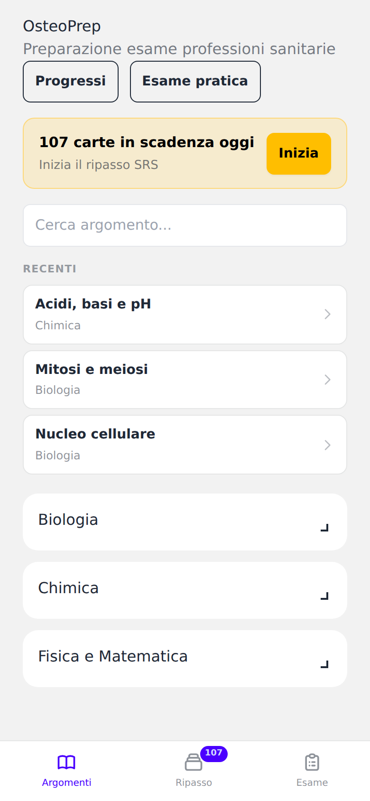
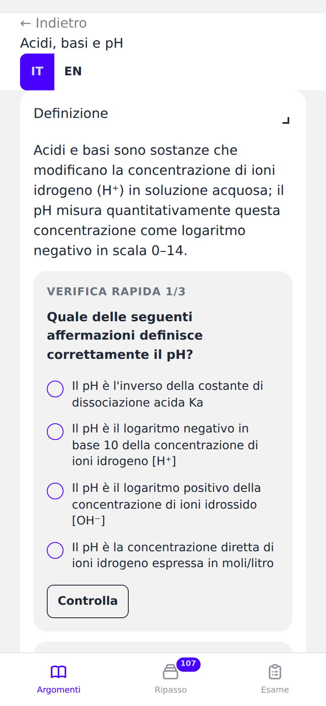
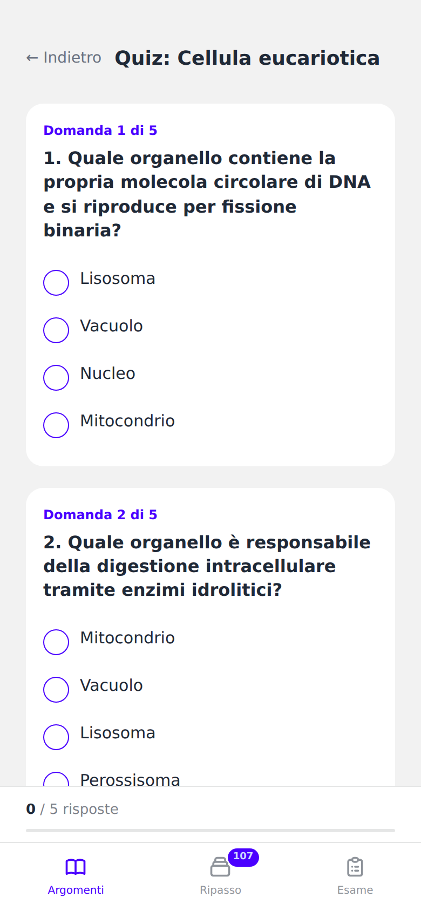

# OsteoPrep

A study app for Italian healthcare/osteopathy entrance exams (*professioni sanitarie*). Built with FastAPI, HTMX, and DaisyUI — designed for mobile-first use, works offline.

<!-- Screenshots: add your own images to docs/screenshots/ and uncomment
<p align="center">
  
  
  
</p>
-->

## Features

### Study content
- **AI-generated topic explainers** — collapsible sections with Italian/English toggle, Wikipedia hero images
- **Inline section micro-quizzes** — 2-3 MCQs embedded in each topic section for active recall while reading
- **AI chat assistant** — ask Claude about any topic, quiz result, or exam score (SSE streaming)

### Practice modes
- **Topic quiz** (5 MCQs) — per-topic practice with cached AI explanations
- **Cross-subject quiz** (10 MCQs) — random questions across all topics in a subject
- **Timed practice exam** (20 questions, 40 min) — simulates the real entrance exam format with countdown timer and progress bar
- **Generate new questions** — on-demand Claude-generated MCQs so you never run out of practice material

### Spaced repetition
- **Flashcard review** with [FSRS](https://github.com/open-spaced-repetition/py-fsrs) algorithm
- Keyboard shortcuts: Space/Enter to flip, 1-4 to rate (Again/Hard/Good/Easy)
- Subject filters, shuffle toggle, cramming mode

### Progress tracking
- Due cards count on home page
- Per-subject completion stats
- Quiz/exam score history

## Tech stack

| Layer | Tech |
|---|---|
| Backend | FastAPI, SQLAlchemy (async), SQLite |
| Frontend | HTMX, DaisyUI (Tailwind CSS, pre-compiled) |
| AI | Anthropic Claude (haiku) — generate-once-cache pattern |
| SRS | py-fsrs 6.3.0 |
| Migrations | Alembic |

No build step. No Node.js required. Tailwind/DaisyUI CSS is pre-compiled and checked in.

## Quick start

```bash
# Clone and set up
git clone https://github.com/LindaPetrini/osteoprep.git
cd osteoprep
python -m venv .venv
source .venv/bin/activate
pip install -r requirements.txt

# Seed the database (first time only)
python seed_topics.py
python seed_flashcards.py
python seed_quiz_questions.py
python seed_exam_questions.py

# Run
uvicorn app.main:app --host 0.0.0.0 --port 8080
```

Open [http://localhost:8080](http://localhost:8080).

### AI features (optional)

To enable AI-generated content, chat, and new question generation:

```bash
echo "ANTHROPIC_API_KEY=sk-ant-..." > .env
```

Without the key, all quiz/review/exam/flashcard features work fine — AI features simply show a graceful fallback.

### Offline use (Mac + phone via USB)

See [OFFLINE.md](OFFLINE.md) for instructions on running locally and connecting your phone over USB with no internet.

## Project structure

```
app/
  main.py              # FastAPI app + lifespan
  models.py            # SQLAlchemy models
  database.py          # Async engine + session
  templates_config.py  # Jinja2 setup + custom filters
  routers/
    pages.py           # Page routes (home, topic, quiz, exam, review, progress)
    fragments.py       # HTMX fragment endpoints
    quiz.py            # Quiz logic + scoring
    exam.py            # Timed exam logic
    review.py          # FSRS flashcard review
    chat.py            # AI chat streaming
    section_quiz.py    # Inline section micro-quizzes
    progress.py        # Progress dashboard
  services/
    claude.py          # Anthropic API integration + prompts
    fsrs_service.py    # FSRS spaced repetition
    progress_service.py
    completion_service.py
  templates/           # Jinja2 templates (HTMX-driven)
migrations/            # Alembic migrations
static/                # Pre-compiled CSS + JS
seed_*.py              # Database seeding scripts
```

## Subjects covered

- **Biology** — cell biology, genetics, evolution, nervous system, organ systems, biotechnology
- **Chemistry** — atomic structure, periodic table, chemical bonds, acids/bases, organic chemistry
- **Physics & Math** — mechanics, thermodynamics, electromagnetism, optics, logic
- **Logic** — verbal reasoning, numerical sequences, logical deductions

## License

MIT
